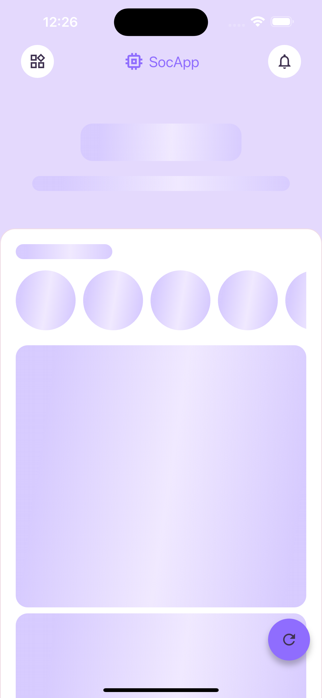
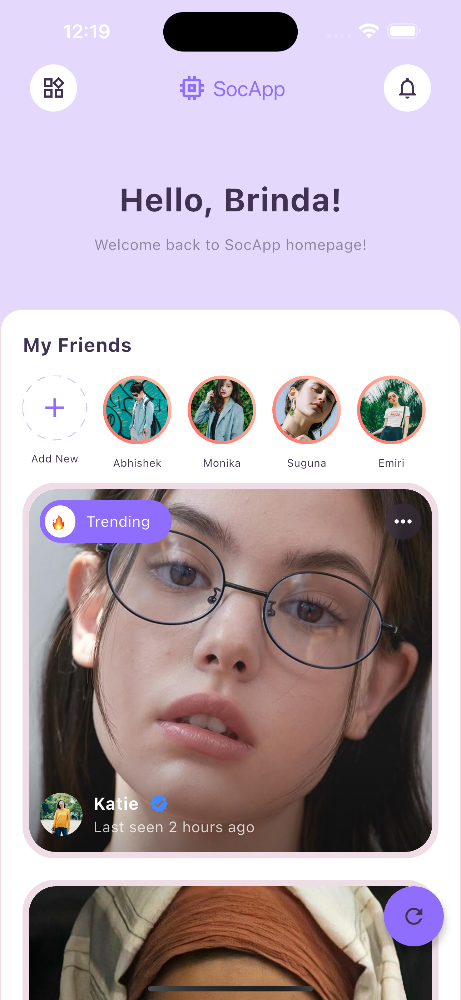
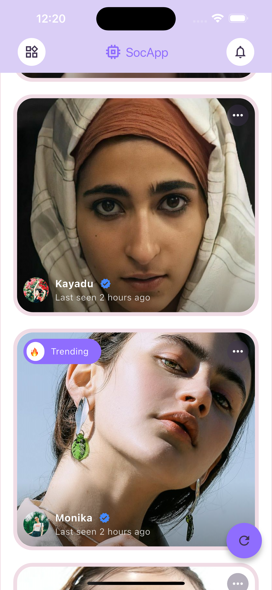

## 🎯 Final UI Screens

Here’s a look at the real app screens while using the **Shimmer Effect** in a Flutter app built with **Clean Architecture**.

---

### 🕸️ Shimmer Loading Screen



🔹 Shows loading placeholders using shimmer effect while waiting for data from API or local database.

---

### 📋 Fetched Data UI




🔹 Displays user data and posts after successful data fetch.  
🔹 Data is retrieved using proper clean architecture layers (use case → repository → data source).

---

### 🔄 Clean Architecture Flow Visual


🧠 This diagram shows how each layer communicates cleanly:  
`UI → UseCase → Repository → DataSource → Model`

---

## 📸 How to Add Your Screenshots

1. Place your images in:  
   `assets/screenshots/`

2. Update your `pubspec.yaml`:
   ```yaml
   flutter:
     assets:
       - assets/screenshots/
