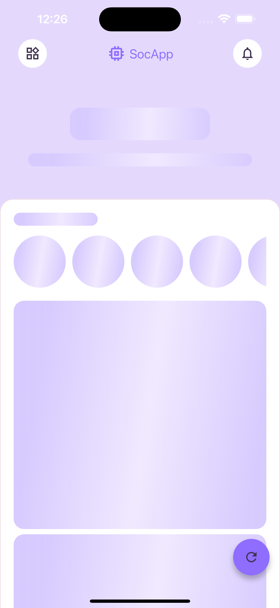
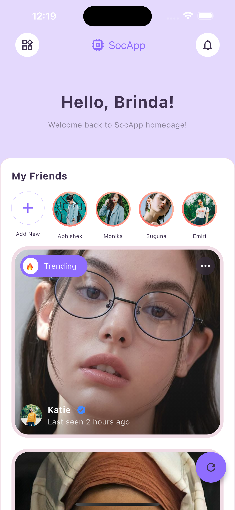
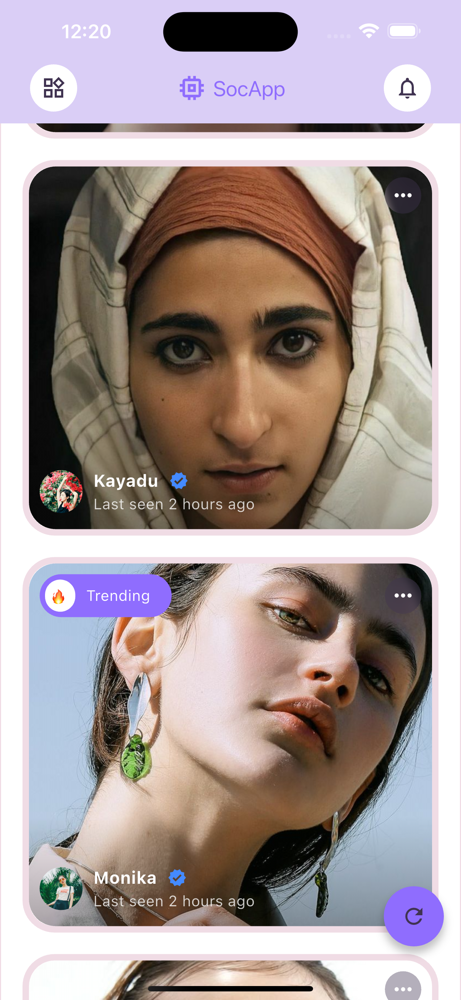

## 🎯 Final UI Screens

Here’s a look at the real app screens while using the **Shimmer Effect** in a Flutter app built with **Clean Architecture**.

---

### 🕸️ Shimmer Loading Screen

🔹 Shows loading placeholders using shimmer effect while waiting for data from API or local database.

---

### 📋 Fetched Data UI

🔹 Displays user data and posts after successful data fetch.  
🔹 Data is retrieved using proper clean architecture layers (use case → repository → data source).
